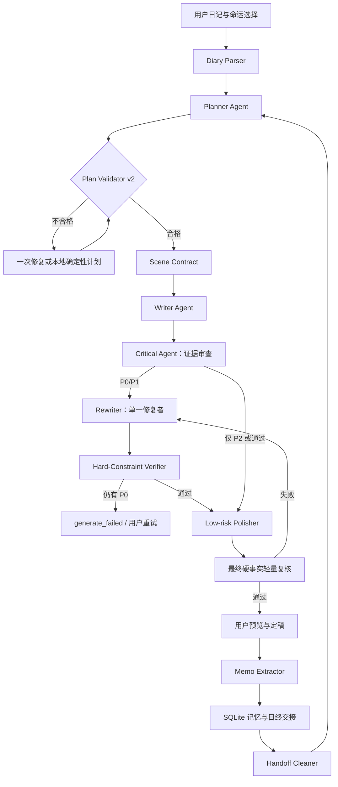

# My Story 复赛优化 PRD V2：场景级剧情契约与分级审查

> 文档状态：Ready for Development  
> 版本：v2.0  
> 日期：2026-08-03  
> 目标分支：`chore/local-baseline-20260802`  
> 主要开发执行者：Terra  
> 优先级：P0（复赛核心体验）  
> 上游文档：`docs/PRD-日终交接单与编剧规划器.md`

## 1. 文档目的

V1 已经完成日终交接单、Story Planner、计划持久化以及 Writer/Critical 共用计划等基础能力。本 PRD 不重复建设数据底座，重点解决真实 DeepSeek 七日测试中暴露出的第二阶段问题：

- 约束已经存在，但仍像“供模型阅读的清单”，没有成为逐场景可执行、可验收的合同；
- 上游交接单可能包含残句，Planner 会把残句继续传给 Writer；
- 日记事件虽然被提到，却未必形成“行动 → 状态变化 → 后续影响”；
- 用户命运选择虽然出现在 Prompt 中，却未必产生可观察的风险或代价；
- Critical 同时承担审查和改稿，多次改稿可能引入新事实；
- 润色阶段可能破坏已经通过审查的场景、事实和因果关系；
- 当前审查没有充分区分硬错误、可修复问题和文学建议，容易出现过度阻塞。

本期目标是把当前生成链路从“多层提示 + 多轮自我修改”升级为：

> 干净交接单 → 场景级剧情合同 → Writer 单向执行 → Critical 提供证据 → 单一 Rewriter 修复 → 硬约束复核。

## 2. 研究结论与问题证据

### 2.1 当前已经具备的能力

- `MemoExtractor` 在定稿后生成实体、伏笔和日终交接单；
- `StoryPlanner` 在 Writer 前生成结构化计划；
- `StoryPlanValidator` 能检查计划字段、日记覆盖、选择匹配和禁止项继承；
- `PromptBuilder` 将交接、五层记忆、日记、选择和计划交给 Writer；
- `ReviewLoop` 执行两轮审查，并在润色后再次复核；
- `StoryEngine` 在审查失败时调用定向修复；
- `day_handoff` 与 `story_plan` 已进入本地 SQLite、Mock 和数据备份恢复链路。

### 2.2 第 4 天真实测试输入

用户日记：

> 今天完成“会议报告”很疲惫，但同事答应帮我“调班”，我因此能继续调查。

此前用户选择：

> 主动追踪纹章来源，并承担更高风险以换取线索。

### 2.3 第 4 天被 Critical 拦截的问题

| 编号 | 问题 | 产品判断 | 严重级别 |
| --- | --- | --- | --- |
| D4-01 | 开头漏掉“嵌入怀表、机关转动、铁门打开”等上一日未完成动作 | 真正的跨日断接 | P0 |
| D4-02 | “会议报告”和“同事调班”未全部形成实际行动与后果 | 日记影响失效 | P0 |
| D4-03 | 夜间仓库直接跳到清晨报社，没有桥接 | 时间线断裂 | P0/P1 |
| D4-04 | “决定去图书馆”等行动重复，场景衔接混乱 | 局部结构问题 | P1 |
| D4-05 | 怀表原本停在十点十七分，后文指针跳动但未解释为异常 | 已确认事实冲突 | P0 |
| D4-06 | 用户选择主动冒险，但正文没有明确风险、损失、暴露或义务 | 选择无实际后果 | P0 |
| D4-07 | 高风险经历后的心理变化不足 | 文学表现建议 | P2 |
| D4-08 | 交接来源出现“声。林墨将怀表……”一类残句 | 上游交接污染 | P0 |

### 2.4 根因分析

1. **Handoff 只有字段完整性，没有文本质量门禁。** 非空残句也会被当成合法 `sourceFact`。
2. **Plan 只有对象级 schema，没有场景分配约束。** 日记因果存在于数组中，但不保证出现在某个具体 scene/beat。
3. **Validator 主要检查“有没有”，没有检查“是否具体、可观察、可执行”。** “改变风险或关系”这种泛化描述也能通过。
4. **Writer 看到的规则过多且优先级竞争。** 记忆、RAG、日记、奇遇、大纲、计划和通用写作要求同时存在，模型可能选择性执行。
5. **Critical 兼任审查与写作。** `revised_content` 允许 Critical 重写全文，下一轮又可能审查并重写，事实在多个角色间漂移。
6. **Polisher 输出整篇正文。** 即使提示“不要改变情节”，全量重写仍可能删除动作、修改顺序或弱化因果。
7. **审查严重度没有进入控制流。** P2 文学建议可能与 P0 连续性错误一起导致失败。

## 3. 产品目标与非目标

### 3.1 产品目标

- 上一天交接单进入 Planner 前必须是完整、明确、可执行的状态描述；
- 每条日记事件必须被分配到具体场景，并产生可观察的状态变化；
- 用户选择必须被分配到具体场景，并产生风险、损失、暴露、资源、关系或义务变化；
- Writer 开写前得到一份顺序明确的场景合同，而不是松散建议；
- Critical 只输出结论、错误码和正文证据，不直接负责大规模重写；
- 只有 P0 硬错误阻断生成，P1 自动修复一次，P2 仅记录建议；
- 由一个专门 Rewriter 根据同一份合同统一修复；
- 润色不得重排场景、删除动作、改变事实或改写结尾状态；
- 真实 DeepSeek 七日测试能够稳定完成，并保存逐日计划、交接和审查证据；
- 控制 AI 调用次数、生成时延和测试成本，避免无限审查循环。

### 3.2 非目标

- 本期不增加新的云数据库或常驻后端；
- 本期不让用户直接编辑内部场景合同；
- 本期不重新设计全部 90 天剧情大纲；
- 本期不追求每篇文学质量都达到出版标准；
- 本期不以降低连续性标准换取测试通过；
- 本期不新增更多能够互相改稿的 Agent。

## 4. Agent 职责边界

### 4.1 核心 Agent

| Agent | 唯一职责 | 允许做什么 | 禁止做什么 |
| --- | --- | --- | --- |
| Planner | 生成当天场景级剧情合同 | 分配场景、动作、因果、选择后果和结束状态 | 不写小说正文，不虚构用户选择 |
| Writer | 按合同完成第一版正文 | 文学表达、对话、氛围、场景细节 | 不换主线，不删除合同动作，不改硬事实 |
| Critical | 基于证据验收正文 | 输出错误码、严重度、合同项和正文证据 | 不输出整篇修订正文，不新增情节 |
| Rewriter | 根据问题清单统一修复 | 修改必要场景，必要时重写完整一天 | 不改变未被问题涉及的硬事实与选择 |

### 4.2 辅助角色

- Diary Parser：提取日记事件、行为与关键词；
- Memo Extractor：提取实体、伏笔、日终交接；
- Polisher：仅进行低风险语言润色；
- Summary Generator：章节边界生成摘要；
- Diary Influence Auditor：只在本地覆盖判断不确定时执行语义核对。

### 4.3 目标 Graph



## 5. 核心产品设计

### 5.1 Handoff Cleaner：交接单质量门禁

在交接单进入 Planner 前新增纯本地清洗和验证，不新增正常路径 AI 调用。

#### FR-V2-01：交接文本完整性

以下字段必须满足完整性要求：

- `active_goal`
- `unfinished_action`
- `immediate_next_action`
- `hard_facts[]`
- `prohibited_changes[]`

最低规则：

1. 去除开头残余标点、乱码、孤立引号和截断前缀；
2. 文本不得以“的、了、着、和、但、声。”等明显残句开头；
3. 动作字段必须包含人物/主体和动作动词；
4. 单项长度建议 8～160 个字符；
5. `unfinished_action` 与 `immediate_next_action` 不得只是同义重复；
6. 清洗后仍不合法时，从最终正文最后 1,500～2,000 字和既有实体状态构造 fallback；
7. fallback 必须标记原因，例如 `fallback_reason = truncated_sentence`。

#### FR-V2-02：硬事实标准化

将高风险事实标准化为可比较形式：

```json
{
  "subject": "铜制怀表",
  "attribute": "指针状态",
  "value": "停在十点十七分",
  "confidence": "confirmed",
  "sourceDay": 3
}
```

第一版不要求完全替换原字符串字段，可以新增 `factRecords` 并保留 `hardFacts` 兼容旧数据。

### 5.2 Story Plan v2：场景级剧情合同

现有 `beats` 升级为 `scenes`。每个日记事件、命运后果和跨日动作必须绑定到具体 scene ID。

#### FR-V2-03：Scene Contract Schema

```json
{
  "schemaVersion": 2,
  "dayNumber": 4,
  "openingContract": {
    "previousState": "林墨停在旧仓库暗门前，准备使用铜制怀表",
    "requiredFirstAction": "林墨将怀表嵌入暗门凹槽并观察机关反应",
    "timeBridgeRequired": false,
    "completionEvidence": "正文前 15% 必须出现该动作及其直接结果"
  },
  "scenes": [
    {
      "sceneId": "S1",
      "purpose": "完成跨日承接",
      "time": "深夜",
      "location": "旧仓库暗门前",
      "requiredActions": ["怀表嵌入凹槽", "机关产生反应"],
      "stateChanges": ["暗门状态从关闭变为开启或明确无法开启"],
      "requiredFactIds": ["F-clock-material", "F-clock-time"]
    },
    {
      "sceneId": "S2",
      "purpose": "落实会议报告",
      "requiredActions": ["林墨完成并提交报告"],
      "stateChanges": ["获得许可、资源或信任变化"],
      "diaryEventIds": ["D-report"]
    },
    {
      "sceneId": "S3",
      "purpose": "落实调班与命运代价",
      "requiredActions": ["同事明确接替值班", "林墨利用时间继续调查"],
      "stateChanges": ["产生人情债", "林墨行踪暴露"],
      "diaryEventIds": ["D-shift"],
      "choiceEffectIds": ["C-bold-risk"]
    }
  ],
  "transitionContracts": [
    {
      "fromSceneId": "S1",
      "toSceneId": "S2",
      "mustExplain": "林墨如何离开仓库、度过剩余夜晚并到达报社"
    }
  ],
  "endingContract": {
    "resultingState": "林墨获得继续调查的时间，但身份被未知人物察觉",
    "nextAction": "在下一次值班前查明跟踪者身份",
    "blockingRisk": "跟踪者已知道林墨与怀表有关"
  },
  "forbiddenChanges": [
    "铜制怀表不得无解释改变材质",
    "指针若离开十点十七分，必须明确写成异常并产生后果"
  ]
}
```

#### FR-V2-04：日记事件必须分配到场景

1. Diary Parser 为每个核心事件生成稳定 ID；
2. 每个事件必须出现在一个或多个 `scene.diaryEventIds` 中；
3. 每个事件必须对应至少一个 `requiredAction` 和一个 `stateChange`；
4. 不接受“推动剧情”“改变关系或风险”一类不可验收的泛化后果；
5. 对“因为、所以、从而、导致”关系进行结构化保存，不要求正文机械使用这些连接词。

#### FR-V2-05：命运选择必须有可观察代价

选择后果至少匹配以下一种类型：

- `risk`：被发现、受伤、调查难度增加；
- `loss`：失去物品、机会、金钱或安全位置；
- `exposure`：身份、行踪或目标暴露；
- `obligation`：欠下人情、接受任务或承诺；
- `relationship`：信任、冲突、联盟状态改变；
- `resource`：获得或消耗时间、通行权限、情报；
- `goal`：下一步目标发生用户选择所导致的变化。

Planner 不得只输出“承担更高风险”，必须说明谁发现了什么、失去了什么或新增了什么义务。

### 5.3 Plan Validator v2

#### FR-V2-06：本地语义具体度校验

Validator v2 除 schema 外必须检查：

1. `previousState`、`requiredFirstAction` 均为完整句；
2. 第一个 scene 必须承接 `requiredFirstAction`；
3. 每个 diary event ID 都至少绑定一个 scene；
4. 每个 diary event 都有动作和具体状态变化；
5. 存在用户选择时至少有一个 scene 绑定 `choiceEffectIds`；
6. 选择结果包含明确 impact type 和具体对象；
7. 相邻场景发生时间或地点变化时存在 `transitionContract`；
8. `endingContract` 同时包含结果状态、下一步动作和阻碍/风险；
9. 禁止项继承上一日高置信度硬事实；
10. 同一物品/人物在计划内部不得出现自相矛盾的属性。

建议新增错误码：

| 错误码 | 含义 |
| --- | --- |
| P101 | 交接动作是残句或不可执行 |
| P102 | 日记事件未绑定场景 |
| P103 | 日记只有动作，没有状态变化 |
| P104 | 选择后果过于抽象 |
| P105 | 跨场景缺少时间/地点桥接 |
| P106 | 结尾合同不完整 |
| P107 | 计划内部事实冲突 |

### 5.4 Writer 执行策略

#### FR-V2-07：Writer Prompt 重新排序

Writer Prompt 的优先级从高到低为：

1. Scene Contract；
2. 高置信度硬事实与禁止项；
3. 最近一天正文结尾；
4. 当日日记与行为映射；
5. 当前叙事节点和用户选择；
6. 实体、伏笔和较早历史；
7. 世界观 RAG、奇遇和通用文风说明。

Token 超限时不得裁剪 1～5 层。

#### FR-V2-08：Writer 写前检查表

在 Prompt 末尾生成机器可读但不要求输出的检查表：

- `[ ] S1 开场动作已在正文前 15% 完成`
- `[ ] D-report 已出现实际行动和状态变化`
- `[ ] D-shift 已出现实际行动和状态变化`
- `[ ] C-bold-risk 已产生明确代价`
- `[ ] 所有跨时空场景都有桥接句`
- `[ ] 结束状态、下一步行动和阻碍已建立`

Writer 只输出正文和既有引用标注，不输出检查表。

#### FR-V2-09：减少自由漂移

- `temperature` 建议从当前用户值中为主线生成设置上限，例如不高于 `0.65`；
- 奇遇不得覆盖 Scene Contract；
- Writer 可以合并场景，但不得删除该场景的 required actions/state changes；
- 重新生成复用同一合同，只改变表达、对话和次要细节。

### 5.5 Critical 分级审查

#### FR-V2-10：Critical 只输出证据，不输出全文

统一返回：

```json
{
  "passed": false,
  "findings": [
    {
      "code": "C102",
      "severity": "P0",
      "contractId": "D-shift",
      "issue": "调班事件没有形成实际行动",
      "evidence": "正文只提到有半天假，没有同事接替值班的场景",
      "repairInstruction": "增加同事明确接班以及由此产生的人情债"
    }
  ]
}
```

Critical 不再返回 `revised_content`。兼容期可以继续解析旧字段，但新流程不得使用 Critical 的全文改稿。

#### FR-V2-11：严重度与控制流

| 级别 | 定义 | 示例 | 控制流 |
| --- | --- | --- | --- |
| P0 | 用户核心体验或事实错误 | 日记遗漏、选择无后果、硬事实矛盾、跨日动作被跳过 | 必须修复并复核；仍失败则阻断 |
| P1 | 明显影响理解的结构问题 | 时间跳跃、因果不清、结尾无法承接 | 自动修复一次；复核无 P0 时可通过 |
| P2 | 文学建议 | 心理描写偏薄、个别重复、氛围稍弱 | 不阻断，记录建议 |

审查不得要求 Writer 逐字复述 `sourceFact`。只要语义上完成同一动作和状态变化，即视为承接成功。

#### FR-V2-12：稳定错误码

| 错误码 | 问题 | 默认级别 |
| --- | --- | --- |
| C101 | 开场没有承接上一日未完成动作 | P0 |
| C102 | 日记事件缺失或只有提及 | P0 |
| C103 | 用户选择没有具体后果 | P0 |
| C104 | 已确认实体/事实矛盾 | P0 |
| C105 | 场景转换缺少必要桥接 | P1，严重断裂时 P0 |
| C106 | 结束合同未形成 | P1 |
| C107 | 场景顺序或因果重复混乱 | P1 |
| C108 | 文风、心理或表达建议 | P2 |
| C109 | 审查响应格式错误 | 系统错误，不是内容错误 |

### 5.6 Rewriter：单一修复者

#### FR-V2-13：定向修复输入

Rewriter 必须接收：

- 原正文；
- Scene Contract；
- Critical findings；
- 高置信度硬事实；
- 明确的“可修改场景 ID”和“禁止修改项”。

只有存在 P0/P1 时调用一次。修复后由 Hard-Constraint Verifier 复核，不再回到完整两轮文学审查。

#### FR-V2-14：防止修复引入新问题

1. 优先局部替换问题场景；
2. 只有三个以上 scene 同时失败时允许重写完整一天；
3. 修复必须保留未被判错的场景事实；
4. 修复后验证所有 P0 项，而不只验证上一轮问题；
5. 最多一次 Rewriter + 一次硬约束复核；仍失败则 `generate_failed`。

### 5.7 Polisher 降风险

#### FR-V2-15：低风险润色策略

推荐按优先顺序实施：

1. **首选：** 只允许句子级措辞润色，禁止重排段落；
2. 如模型无法稳定执行，复赛版本可暂时关闭全篇 Polisher，直接使用已通过的 Rewriter/Writer 正文；
3. 如保留全篇润色，温度降至 `0.3～0.5`；
4. 润色后只做一次 P0 硬事实轻量复核；
5. 润色造成 P0 时回退到润色前版本，不再重新写整篇。

## 6. 目标控制流

```text
Diary Parser
  → Handoff Cleaner
  → Planner
  → Plan Validator v2
  → Writer
  → Critical（只给 findings）
      → 仅 P2：直接通过
      → P0/P1：Rewriter 一次
          → Hard-Constraint Verifier
              → 有 P0：生成失败
              → 无 P0：通过
  → Low-risk Polisher
      → P0 轻量复核
          → 通过：输出润色稿
          → 失败：回退润色前版本
  → Content Quality Gate
  → 用户预览/定稿
  → Memo Extractor
```

必须移除“Critical 改全文 → Critical 再改全文 → Polisher 改全文 → Critical 再改全文”的漂移路径。

## 7. 数据兼容与迁移

### 7.1 `day_handoff`

建议增加可选字段：

- `quality_status`：`valid | cleaned | fallback`；
- `quality_issues_json`；
- `fact_records_json`；
- `fallback_reason`。

旧交接单读取时即时 normalize，不要求重建旧故事。

### 7.2 `story_plan`

- `schema_version` 支持 1 和 2；
- 新生成使用 schema v2；
- 同段落已有合法 v1 计划时可以继续用于既有草稿；
- 用户重新生成时将 v1 计划升级或重新规划为 v2；
- 新增 `review_findings_json`、`repair_count`、`final_verification_status` 可选字段。

### 7.3 导出与恢复

- 新字段必须进入 `DataExporter`；
- 旧备份导入时提供默认值；
- API Key 仍不得进入任何备份、计划、交接或测试报告。

## 8. 可观测性与成本控制

每次生成记录脱敏指标：

- `handoffQuality`；
- `planSource`：`ai | ai_retry | fallback`；
- `planValidationErrors`；
- `criticalFindingCounts`：P0/P1/P2 数量；
- `rewriterUsed`；
- `polishRolledBack`；
- `aiCallCountsByRole`；
- 各阶段耗时；
- 最终失败阶段和错误码。

禁止记录：API Key、Authorization Header、完整用户日记和完整故事正文。测试报告可以在本地保存脱敏节选。

正常成功路径目标：

- Diary Parser：0～1 次；
- Planner：1 次；
- Writer：1 次；
- Critical：1 次；
- Rewriter：0 次；
- Polisher：0～1 次；
- 最终硬复核：0～1 次；
- Memo Extractor：定稿后 1 次。

不允许无限重试。任何单日生成在业务层最多执行一次 Planner 修复、一次 Rewriter 和一次最终硬复核。

## 9. 测试方案

### 9.1 单元测试

1. Handoff Cleaner 拒绝“声。林墨……”一类残句；
2. Handoff Cleaner 保留合法完整动作；
3. 清洗失败时生成带原因的 fallback；
4. Plan v2 每个日记 ID 必须绑定 scene；
5. 日记 scene 没有 state change 时拒绝；
6. 抽象选择后果“承担更高风险”被拒绝；
7. 具体选择后果“行踪被守夜人发现”被接受；
8. 跨地点缺少 transition contract 时拒绝；
9. ending contract 缺少 next action 时拒绝；
10. 怀表材质或指针状态计划内冲突时拒绝；
11. Critical 仅输出 P2 时不阻断；
12. Critical 输出 P0 时进入 Rewriter；
13. Critical 格式错误返回 C109，不被误判为内容失败；
14. 润色引入事实矛盾时自动回退润色前版本；
15. Rewriter 第二次仍有 P0 时终止，不无限循环。

### 9.2 第 4 天定向回归

固定输入：

- 上一天结束：旧仓库暗门前，怀表即将嵌入凹槽；
- 日记事件：完成会议报告、同事调班、因此继续调查；
- 用户选择：主动追踪纹章来源并承担更高风险；
- 硬事实：怀表为铜制，正常指针停在十点十七分。

必须通过：

1. 正文前 15% 完成怀表与暗门的承接动作；
2. 报告形成资源、许可或关系变化；
3. 调班由具体同事行动体现，并带来时间资源和人情义务；
4. 继续调查直接源于调班获得的时间；
5. 主动追踪产生明确风险、暴露、损失或义务；
6. 仓库到报社等跨场景变化有桥接；
7. 怀表事实不矛盾；如指针移动，明确是异常并造成后果；
8. 结尾形成下一天可执行的目标与阻碍；
9. P2 心理描写建议不得单独阻塞生成。

### 9.3 真实七日测试

要求至少执行 3 个独立 run，避免把模型偶然性当成稳定性：

- 每个 run 完成 7/7 天；
- 6/6 个跨日开场语义承接；
- 7/7 天日记形成行动与后果；
- 用户选择影响通过率 100%；
- P0 硬事实冲突为 0；
- 第 4 天定向要求全部通过；
- 测试失败时仍保存已完成天、最后计划、审查 findings 和调用计数；
- 报告不得包含 API Key；
- 统计平均调用次数和单日耗时。

成功门槛：3 个 run 中至少 2 个完整通过，且任何 run 不允许在相同 P0 问题上连续失败；最终候选版本发布前再完成一次完整通过。

### 9.4 本地与构建回归

- `tests/story-planner.test.mjs`；
- `tests/fullchain.test.mjs`；
- `tests/real-sqlite-memory.test.mjs`；
- `tests/data-export-planning.test.mjs`；
- `tests/real-7day-continuity.mjs`；
- `npm run build`；
- 刷新、导出、导入、编辑定稿和重新生成手工流程。

## 10. 验收标准

### 10.1 P0 功能验收

- Handoff 残句不会进入 Planner；
- Story Plan v2 能定位到具体 scene、diary event 和 choice effect；
- Writer、Critical、Rewriter 使用同一份合同；
- Critical 不再负责输出全文修订稿；
- P0/P1/P2 严重度真实进入控制流；
- P2 不会单独导致 `generate_failed`；
- Rewriter 最多调用一次且修复后重新验证全部 P0；
- 润色破坏硬事实时自动回退；
- 第 4 天定向回归通过；
- SQLite、导出恢复与旧计划兼容。

### 10.2 质量验收

- 用户能够明显感知前一天结尾被继续；
- 日记不是装饰性出现，而是改变资源、关系、风险或下一步目标；
- 命运选择在后续故事中产生可指出的代价；
- 不因审查器的 P2 建议频繁看到生成失败；
- 重新生成保持因果不变，同时文字表达有差异。

### 10.3 性能验收

- 正常路径不新增第二次 Planner 调用；
- 不出现无上限 Critical/Rewriter 循环；
- P50 单日 AI 调用次数和耗时需记录基线，优化后不得高于当前真实测试基线；
- 失败时提供稳定错误码，而不是只显示长段自然语言审查意见。

## 11. Terra 开发任务拆分

### 阶段 A：交接与计划质量

1. 新增 `HandoffCleaner`；
2. 扩展 handoff 数据质量字段；
3. 定义 Story Plan schema v2；
4. 实现 `StoryPlanValidatorV2`；
5. 增加 v1/v2 兼容读取和数据导出。

建议提交：`feat(memory): validate handoff quality and normalize facts`

建议提交：`feat(ai): add scene-level story contract v2`

### 阶段 B：Writer 执行合同

1. 重排 `PromptBuilder` 优先级；
2. 注入 scene checklist；
3. 确保 Token 裁剪不删除合同、选择和当日日记；
4. 收紧 Writer 温度和奇遇优先级；
5. 保持 regenerate 复用合同。

建议提交：`feat(ai): enforce scene contract in writer`

### 阶段 C：审查与修复解耦

1. Critical 改为 findings-only schema；
2. 实现 P0/P1/P2 控制流；
3. 新增专用 Rewriter；
4. 新增 Hard-Constraint Verifier；
5. 移除 Critical 的全文修订职责；
6. 限制修复和复核次数。

建议提交：`refactor(ai): separate critic evidence from story rewriting`

### 阶段 D：润色降风险

1. 实现低风险润色或暂时关闭全篇润色；
2. 增加润色前快照；
3. 润色后只检查 P0；
4. 失败自动回退快照。

建议提交：`fix(ai): prevent polishing from breaking story facts`

### 阶段 E：测试与报告

1. 完成单元测试；
2. 新增第 4 天定向回归；
3. 真实七日测试逐日 checkpoint；
4. 保存计划、findings、调用次数和失败阶段；
5. 执行 3 次真实 run；
6. 完成构建和手工用户流程验证。

建议提交：`test(ai): verify scene contracts and graded review`

## 12. 建议代码改动范围

### 建议新增

- `src/ai/HandoffCleaner.js`
- `src/ai/StoryPlanValidatorV2.js`，或升级现有 Validator 并保留 v1 分支
- `src/ai/StoryRewriter.js`
- `src/ai/HardConstraintVerifier.js`
- `tests/handoff-cleaner.test.mjs`
- `tests/story-contract-v2.test.mjs`
- `tests/day4-causal-regression.test.mjs`
- `tests/graded-review.test.mjs`

### 必须修改

- `src/ai/StoryPlanner.js`
- `src/ai/PromptBuilder.js`
- `src/ai/ReviewLoop.js`
- `src/ai/MemoExtractor.js`
- `src/core/StoryEngine.js`
- `src/db/repositories/DayHandoffRepository.js`
- `src/db/repositories/StoryPlanRepository.js`
- `src/db/DataExporter.js`
- `src/db/migrations/index.js`
- `mock/index.js`
- `tests/fullchain.test.mjs`
- `tests/real-sqlite-memory.test.mjs`
- `tests/real-7day-continuity.mjs`

## 13. 风险与决策

| 风险 | 影响 | 应对 |
| --- | --- | --- |
| Scene Contract 过细，正文显得机械 | 文学体验下降 | 约束动作与状态，不约束具体句式和对话 |
| Critical 分级错误 | 硬错误被放行或建议过度阻塞 | 错误码固定、P0 本地规则优先、保存证据 |
| Rewriter 重写引入新事实 | 连续性再次破坏 | 单一修复者、全量 P0 复核、最多一次 |
| 润色继续破坏剧情 | 通过稿再次失败 | 低温、禁止重排、失败回退润色前版本 |
| AI 调用次数过多 | 延迟和成本上升 | 正常路径一次 Critical，修复路径严格封顶 |
| v1/v2 数据不兼容 | 旧用户故事不可继续 | schemaVersion 分流、读取时 normalize、迁移不清数据 |

已确定决策：

- 不降低日记影响、选择后果和硬事实一致性的标准；
- 审查必须分级，P2 不阻塞；
- Planner 负责“怎么发生”，Writer 负责“怎么写”；
- Critical 负责证据，Rewriter 负责修改；
- 润色不是必须成功的核心步骤，破坏事实时必须回退；
- 正常生成仍只增加一次 Planner 调用；
- 数据继续保存在浏览器本地 SQLite，Vercel 只代理 AI 请求。

## 14. Definition of Done

只有同时满足以下条件，本 PRD 才算开发完成：

- Handoff Cleaner、Story Plan v2、Validator v2、分级 Critical 和单一 Rewriter 均已实现；
- Planner/Writer/Critical/Rewriter 职责与本 PRD 一致；
- 第 4 天定向回归全部通过；
- 真实七日测试至少完成规定的稳定性门槛；
- P0 硬错误为 0，P2 不会单独阻断；
- 润色破坏事实时可以自动回退；
- 旧 SQLite、旧备份和 v1 计划可兼容；
- API Key 不进入仓库、数据库、报告或日志；
- 全部自动化测试和生产构建通过；
- 代码提交到功能分支并通过审查，不直接合并 `main`；
- 测试报告包含逐日 checkpoint、调用计数、findings 和最终结论。

