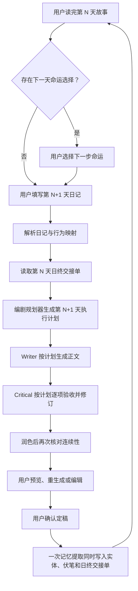

# My Story 复赛优化 PRD：日终交接单与编剧规划器

> 文档状态：Ready for Development
> 版本：v1.0
> 日期：2026-08-02
> 目标开发分支：`chore/local-baseline-20260802`
> 主要开发执行者：Terra
> 优先级：P0（复赛核心体验）

## 1. 产品背景

My Story 当前已经具备以下能力：

- 将用户日记映射为小说世界中的行为与事件；
- 读取最近故事原文、章节摘要、历史剧情 RAG、实体状态、伏笔池等多层记忆；
- 通过 Writer 生成正文，再由 Critical/ReviewLoop 审查、修改和润色；
- 在关键剧情节点让用户选择下一步命运，并把选择写入叙事状态图；
- 在每日故事定稿后，将实体、物品、地点和伏笔写入本地 SQLite。

真实连续生成测试暴露出的核心问题不是“完全没有记忆”，而是“记忆没有被转化为下一天必须执行的因果任务”。Writer 会同时阅读大量历史信息，却没有一份优先级最高、结构固定、可以被 Critical 逐项验收的跨日交接契约。

因此模型可能记得“怀表、纹章、旧仓库”等关键词，却仍然发生以下问题：

- 第二天开头没有承接前一天结尾正在发生的动作；
- NPC、物品、地点的细节被悄悄修改；
- 用户选择只被复述，没有真正造成代价或收益；
- 当日日记被写进正文，但没有改变人物行动和剧情结果；
- Writer 为了制造新的悬念，擅自更换目标、线索来源或未完成任务；
- 润色或重新生成时破坏已经建立的事实。

## 2. 本次需求结论

新增两个互相配合的内部能力：

1. **日终交接单（Day Handoff）**：每天定稿后，从最终正文中提取“故事现在停在哪里、谁处于什么状态、下一步必须承接什么、哪些事实绝对不能改”。
2. **编剧规划器（Story Planner）**：下一天写正文前，综合上一天交接单、当日日记、用户命运选择、叙事图和长期记忆，先生成一份结构化的“当天剧情执行计划”，再交给 Writer 写正文，并交给 Critical 逐项验收。

核心原则：

> 数据库负责记住事实，日终交接单负责明确跨日接口，编剧规划器负责把记忆变成因果计划，Writer 负责文学表达，Critical 负责检查计划是否真的被执行。

## 3. 产品目标与非目标

### 3.1 产品目标

- 第 N+1 天的开头能够自然承接第 N 天的结尾，或对时间跳跃给出合理桥接。
- 用户日记必须造成至少一个可观察的剧情变化，而非只作为装饰性提及。
- 用户在关键节点做出的选择必须在后续行动、关系、风险、资源或结果上产生影响。
- 人物、物品、地点、目标、伤势、关系和未解线索不得无解释地改变。
- Writer、Critical 和润色阶段共享同一份结构化计划，避免各阶段理解不同。
- 正常生成只新增一次低温、短输出的 AI 规划调用。
- 所有长期数据仍存储在用户浏览器内的 SQLite，不新增常驻后端数据库。
- 重新生成、用户手动编辑、异常降级后仍保持记忆闭环。

### 3.2 非目标

- 本期不重写 90 天完整世界观和剧情大纲。
- 本期不开发可视化剧情编辑器。
- 本期不让用户直接编辑内部编剧计划。
- 本期不增加独立的云端用户账户或云数据库。
- 本期不要求 AI 每天强制回收伏笔；伏笔推进应服从剧情节奏。
- 本期不改变“用户读完上一天故事后，在关键节点选择下一步命运”的既有交互。

## 4. 核心概念

### 4.1 日终交接单

日终交接单不是当天故事摘要。摘要回答“今天发生了什么”，交接单回答“故事结束时形成了哪些不可绕过的下一步条件”。

必须包含：

- 结束场景：时间、地点、在场人物、即时环境；
- 主角与关键人物当前状态：身体、情绪、能力、持有物、关系变化；
- 已确认的硬事实；
- 当前主要目标；
- 已经开始但尚未完成的动作；
- 下一天最自然的第一步行动；
- 未解决冲突和悬念；
- 不允许无解释改变的事项；
- 与下一次用户命运选择相关的上下文（如有）。

### 4.2 当天剧情执行计划

执行计划不是正文大纲的同义词。它必须明确从上一天状态到今天结束状态之间的因果路径，并说明用户日记和命运选择在哪里改变了剧情。

必须包含：

- 如何承接上一天结尾；
- 必须保留的连续性锚点；
- 当日日记事件如何世界观化，以及造成什么后果；
- 已选命运选项在今天产生的具体后果；
- 3～5 个按顺序执行的剧情节拍；
- 实体状态预计如何变化；
- 今天推进、回收或继续保留哪些伏笔；
- 预期结束状态和下一天钩子；
- 本次正文禁止出现的矛盾。

## 5. 用户流程



第一天没有上一日交接单时，规划器使用世界观、第一章目标、首日日记和叙事图生成开篇计划，不报错、不制造虚构的前情。

## 6. 功能需求

### FR-01：定稿后生成日终交接单（P0）

1. 扩展现有 `MemoExtractor` 的一次 AI 调用，使其同时输出：
   - `entities`
   - `foreshadowing_planted`
   - `foreshadowing_resolved`
   - `day_handoff`
2. 不再为日终交接单单独增加第二次 AI 调用。
3. 必须基于用户最终确认的正文提取，而不是 Writer 最初草稿。
4. 交接单提取成功后写入本地 SQLite，并与 `day_number`、`segment_id` 关联。
5. 同一天重复定稿或更新时使用 upsert，不产生多份互相冲突的有效交接单。
6. 正文过长时不能只截取开头。交接提取至少必须包含正文最后 1,500～2,000 字；实体与伏笔可使用头尾组合截取。
7. AI 提取失败时使用确定性降级：保存正文末尾片段、已知实体状态、未回收伏笔和默认下一步提示。降级交接单标记 `source = fallback`，但不阻断定稿。

### FR-02：用户编辑后的记忆重新闭环（P0）

当前 `saveEdit()` 直接推进进度并定稿，没有重新执行 `MemoExtractor` 和叙事图推进。这会导致数据库继续记住编辑前的事实。

开发要求：

1. 将 `finalize()` 与 `saveEdit()` 中共同的定稿后处理抽成同一条内部管线，例如 `_finalizeContentPipeline(segment, finalContent)`。
2. 用户编辑后的最终正文必须重新执行：
   - 实体/伏笔/交接单提取；
   - 叙事节点完成状态更新；
   - 进度更新；
   - 章节边界检查；
   - 最终状态写入。
3. 如果同一天已有旧交接单，必须被新正文对应的交接单覆盖，并更新正文指纹。
4. 任一非关键辅助提取失败不应让用户已经编辑完成的正文丢失；错误应被记录并使用降级交接单。

### FR-03：生成正文前调用编剧规划器（P0）

1. 在 `DiaryParser`、行为映射、叙事图上下文和多层记忆准备完成后，在 Writer 之前调用 `StoryPlanner`。
2. 输入至少包括：
   - 上一天日终交接单；
   - 当日日记解析结果与行为映射；
   - 当前叙事节点；
   - 用户已经选择的命运及其长期影响；
   - 相关实体状态和未回收伏笔；
   - 当前章节目的；
   - 奇遇事件（如当天触发）。
3. 正常路径只允许一次规划调用，建议参数：`temperature = 0.2`、`maxTokens = 1000～1400`。
4. 输出必须是结构化 JSON，并通过本地 schema validator 验证。
5. JSON 格式错误或缺少硬约束时允许一次短重试；重试仍失败则使用本地确定性计划，不阻断用户生成。
6. 规划结果写入 SQLite，便于重新生成、测试和问题追踪。
7. Writer 调用失败时保留计划；用户重试同一段生成时复用有效计划，避免每次重试改变剧情方向。

### FR-04：Writer 必须执行计划（P0）

1. `PromptBuilder` 新增“当天剧情执行计划”区块。
2. 此区块属于不可裁剪的高优先级上下文，Token 超限时优先削减世界观 RAG 和较早原文，不得删除交接单和执行计划。
3. Writer 必须满足：
   - 第一场景承接 `openingBridge`；
   - 每个 `continuityAnchor` 均不被否定；
   - 每个核心日记事件至少有一个实际行动及其后果；
   - 用户选择产生可观察后果；
   - 剧情节拍按因果顺序推进，但允许文学表达上的合并；
   - 结尾与 `endingTarget` 方向一致；
   - 不得违反 `forbiddenChanges`。
4. 如果采用时间跳跃，正文必须明确交代从上一日结束状态到新场景之间的桥接结果。
5. `REGENERATE_HINT` 调整为“更换表达、场景细节或局部节拍”，不得要求“完全不同的剧情走向”从而推翻既有计划。

### FR-05：Critical 按计划验收（P0）

`ReviewLoop` 的两轮审查和润色后复核必须同时接收执行计划，至少检查以下错误码：

| 错误码 | 含义 | 判定示例 |
| --- | --- | --- |
| C001 | 开头断接 | 昨天停在旧仓库门口，今天无解释地出现在另一座城市 |
| C002 | 硬事实矛盾 | 已确认怀表为铜制，后文无解释改为银制 |
| C003 | 选择无后果 | 用户选择主动冒险，但正文仍按谨慎观察路线发展 |
| C004 | 日记仅被提及 | 写到了“开会”，但会议没有改变行动、关系或结果 |
| C005 | 当前目标漂移 | 昨天决定追查钟表匠，今天无解释更换为另一条主线 |
| C006 | 实体非法突变 | NPC 关系、伤势、持有物或能力无铺垫变化 |
| C007 | 计划结尾缺失 | 正文没有形成计划要求的结束状态或后续钩子 |

要求：

1. 审查返回保持现有 `passed/issues/revised_content` 兼容格式，`issues` 中附带错误码。
2. Critical 的修改稿只能修复违规，不能引入新的事实或更换用户选择。
3. 润色后复核继续使用同一份计划，防止润色破坏事实。
4. 计划执行失败且自动修订后仍不通过时，保持 `generate_failed`，不向用户伪装为成功。

### FR-06：重新生成保持因果不变（P0）

1. 同一个 `segment_id` 的重新生成默认复用原计划。
2. 允许改变措辞、场景表现、对话、次要事件和节奏。
3. 不允许改变：上一日承接点、用户选择、日记核心因果、硬事实、必须推进的当前目标。
4. 如原计划本身已失效，例如用户修改了日记或命运选择，先将旧计划标记 `invalidated`，再生成新计划。
5. 计划是否可复用通过输入指纹判断，不依赖时间判断。

### FR-07：用户命运选择接入计划（P0）

1. 保留现有“读完上一天结尾后选择下一步命运”的界面与 `NarrativeGraph`。
2. 规划器必须读取 `selected_option_desc` 和 `selected_effect`。
3. 计划中的 `choiceConsequence` 需要指出选择在当天产生的具体影响类型：风险、资源、关系、信息、时间成本或目标变化。
4. 如果当前不存在命运选择，字段明确为 `null`，不得由 AI 替用户虚构选择。
5. 用户选择属于最高级硬约束，不能被日记映射、奇遇或固定大纲覆盖。

### FR-08：无常驻后端的数据策略（P0）

1. `day_handoff` 和 `story_plan` 与现有故事数据一样，保存在浏览器本地的 sql.js/SQLite 持久化层中。
2. Vercel Serverless Function 只代理 AI 请求和保护 API Key，不保存用户故事记忆。
3. 刷新页面后交接单和计划仍可读取。
4. 数据导出/恢复应包含新增表；旧备份没有新增字段时应正常迁移。
5. 日终交接单与计划不得包含 API Key、Authorization Header 或加密密钥字段。

### FR-09：可诊断性（P1）

1. 每次生成记录但不展示给普通用户：计划 ID、来源交接单天数、是否降级、验证结果、失败错误码。
2. 测试/开发模式可以在设置页查看结构化交接单和计划；正式演示默认隐藏。
3. 禁止把完整用户日记或故事正文写入生产控制台日志。

## 7. 数据结构设计

### 7.1 `day_handoff`

建议新增表：

```sql
CREATE TABLE IF NOT EXISTS day_handoff (
  id                    INTEGER PRIMARY KEY AUTOINCREMENT,
  day_number            INTEGER NOT NULL UNIQUE,
  segment_id            INTEGER NOT NULL,
  schema_version        INTEGER NOT NULL DEFAULT 1,
  ending_scene_json     TEXT NOT NULL,
  character_state_json  TEXT NOT NULL,
  hard_facts_json       TEXT NOT NULL,
  active_goal           TEXT,
  unfinished_action     TEXT,
  immediate_next_action TEXT,
  unresolved_threads_json TEXT NOT NULL,
  prohibited_changes_json TEXT NOT NULL,
  choice_context_json   TEXT,
  source                TEXT NOT NULL DEFAULT 'ai',
  source_content_hash   TEXT NOT NULL,
  created_at            TIMESTAMP DEFAULT CURRENT_TIMESTAMP,
  updated_at            TIMESTAMP DEFAULT CURRENT_TIMESTAMP,
  FOREIGN KEY (segment_id) REFERENCES story_segments(id)
);
CREATE INDEX IF NOT EXISTS idx_handoff_segment ON day_handoff(segment_id);
```

### 7.2 `story_plan`

建议新增表：

```sql
CREATE TABLE IF NOT EXISTS story_plan (
  id                    INTEGER PRIMARY KEY AUTOINCREMENT,
  day_number            INTEGER NOT NULL,
  segment_id            INTEGER NOT NULL,
  previous_handoff_day  INTEGER,
  schema_version        INTEGER NOT NULL DEFAULT 1,
  plan_json             TEXT NOT NULL,
  status                TEXT NOT NULL DEFAULT 'planned',
  source                TEXT NOT NULL DEFAULT 'ai',
  input_fingerprint     TEXT NOT NULL,
  validation_errors_json TEXT,
  created_at            TIMESTAMP DEFAULT CURRENT_TIMESTAMP,
  updated_at            TIMESTAMP DEFAULT CURRENT_TIMESTAMP,
  FOREIGN KEY (segment_id) REFERENCES story_segments(id)
);
CREATE INDEX IF NOT EXISTS idx_story_plan_segment ON story_plan(segment_id);
CREATE INDEX IF NOT EXISTS idx_story_plan_day_status ON story_plan(day_number, status);
```

状态取值：

- `planned`：已生成，尚未成功用于正文；
- `used`：正文已经成功生成；
- `invalidated`：输入变化，计划不可继续复用；
- `failed`：AI 与本地降级均无法形成合法计划，理论上不应常见。

### 7.3 数据迁移要求

- 新安装数据库直接通过 `schema.js` 建表。
- 已安装用户通过 `migrations/index.js` 的幂等迁移建表和索引。
- 迁移不可清空或重建现有故事表。
- 新 Repository 必须支持依赖注入，真实 SQLite 与 Mock 测试使用同一业务接口。

## 8. AI 结构化输出契约

### 8.1 `day_handoff` JSON 示例

```json
{
  "schemaVersion": 1,
  "endingScene": {
    "time": "深夜",
    "location": "旧仓库暗门前",
    "presentCharacters": ["林墨"],
    "physicalState": "疲惫，右手轻微擦伤"
  },
  "characterStates": [
    {
      "name": "林墨",
      "emotion": "警惕但决心继续",
      "possessions": ["铜制怀表", "线索笔记"],
      "relationshipChanges": []
    }
  ],
  "hardFacts": [
    "怀表为铜制",
    "陌生纹章与失踪钟表匠有关",
    "林墨尚未打开暗门"
  ],
  "activeGoal": "确认暗门后的求救线索",
  "unfinishedAction": "林墨正准备使用怀表开启暗门",
  "immediateNextAction": "验证怀表是否能启动暗门机关",
  "unresolvedThreads": [
    {"description": "暗门后有什么", "priority": "high"}
  ],
  "prohibitedChanges": [
    "不得把怀表改成银制",
    "不得在没有桥接的情况下跳过开启暗门"
  ],
  "choiceContext": {
    "option": "主动追踪纹章来源",
    "effect": "承担更高风险以换取线索"
  }
}
```

### 8.2 `story_plan` JSON 示例

```json
{
  "schemaVersion": 1,
  "dayNumber": 4,
  "openingBridge": {
    "sourceFact": "林墨停在旧仓库暗门前，正准备用铜制怀表开启机关",
    "firstSceneAction": "从林墨把怀表嵌入暗门凹槽开始"
  },
  "continuityAnchors": [
    {"fact": "怀表为铜制", "requiredUsage": "作为开启暗门的实物钥匙"},
    {"fact": "林墨选择主动追查", "requiredUsage": "他亲自承担进入暗门的风险"}
  ],
  "diaryCausality": [
    {
      "diaryEvent": "同事答应帮我调班",
      "worldAction": "同伴替林墨承担白天的值守任务",
      "storyConsequence": "林墨获得进入暗门调查的时间，但欠下人情"
    }
  ],
  "choiceConsequence": {
    "choice": "主动追踪纹章来源",
    "impactType": "风险",
    "consequence": "林墨必须亲自进入未知区域并暴露行踪"
  },
  "beats": [
    {"order": 1, "purpose": "跨日承接", "action": "怀表启动暗门", "stateChange": "暗门开启"},
    {"order": 2, "purpose": "日记影响", "action": "同伴代班创造调查窗口", "stateChange": "获得时间并产生人情债"},
    {"order": 3, "purpose": "剧情推进", "action": "林墨进入暗门发现新证据", "stateChange": "风险升级且线索前进"}
  ],
  "entityChanges": [
    {"entity": "铜制怀表", "before": "线索物品", "after": "被确认是机关钥匙"}
  ],
  "foreshadowActions": [
    {"thread": "暗门后有什么", "action": "推进但不完全解释"}
  ],
  "endingTarget": {
    "state": "林墨获得钟表匠的新证据，但被未知人物察觉",
    "nextHook": "追踪者身份仍未揭晓"
  },
  "forbiddenChanges": [
    "不得修改怀表材质",
    "不得让林墨放弃已选择的主动追踪路线",
    "不得让代班只作为一句背景信息"
  ]
}
```

## 9. 本地计划验证器

新增纯本地 `StoryPlanValidator`，不得依赖 AI。最低验证规则：

- `schemaVersion` 为支持的版本；
- `dayNumber` 与当前生成日一致；
- `openingBridge.sourceFact` 和 `firstSceneAction` 非空；
- `continuityAnchors` 至少 1 条（第一天允许由世界观开篇锚点替代）；
- 每个核心日记事件在 `diaryCausality` 中有对应项；
- 存在用户选择时 `choiceConsequence` 不得为 null，且选择文本必须匹配；
- `beats` 为 3～5 条，`order` 连续且每条包含 `action/stateChange`；
- `endingTarget.state` 非空；
- `forbiddenChanges` 至少覆盖上一天交接单中的禁止项；
- 所有字符串和数组设置长度上限，防止异常输出撑爆 Prompt 或数据库。

验证器返回：

```js
{
  valid: false,
  errors: [
    { code: 'P003', path: 'diaryCausality', message: '核心日记事件未形成因果映射' }
  ],
  normalizedPlan: null
}
```

## 10. StoryEngine 集成顺序

目标生成管线：

1. 校验天数与命运选择；
2. 创建/读取日记和段落；
3. 解析日记；
4. 行为映射；
5. 获取叙事图、奇遇和现有五层记忆；
6. 获取上一天 `day_handoff`；
7. 计算计划输入指纹，尝试复用已有有效计划；
8. 无有效计划时调用 `StoryPlanner`；
9. 本地验证并持久化计划；
10. `PromptBuilder` 将计划注入 Writer；
11. Writer 生成初稿；
12. `ReviewLoop` 根据同一计划审查和修订；
13. 润色；
14. 根据同一计划进行润色后复核；
15. 内容质量门禁；
16. 原子提交草稿并将计划标记为 `used`；
17. 用户确认或编辑后执行统一定稿管线；
18. 扩展后的 `MemoExtractor` 写入实体、伏笔和当天交接单。

## 11. 代码改动范围

### 11.1 建议新增

- `src/ai/StoryPlanner.js`
- `src/ai/StoryPlanValidator.js`
- `src/db/repositories/DayHandoffRepository.js`
- `src/db/repositories/StoryPlanRepository.js`
- `mock/MockDayHandoffRepository.js`
- `mock/MockStoryPlanRepository.js`
- `tests/story-planner.test.mjs`
- `tests/day-handoff.test.mjs`
- `tests/planned-continuity.test.mjs`

### 11.2 必须修改

- `src/core/StoryEngine.js`
- `src/ai/MemoExtractor.js`
- `src/ai/PromptBuilder.js`
- `src/ai/ReviewLoop.js`
- `src/db/migrations/schema.js`
- `src/db/migrations/index.js`
- `src/core/index.js`
- `mock/index.js`
- `src/db/DataExporter.js`
- `tests/real-sqlite-memory.test.mjs`
- `tests/real-7day-continuity.mjs`

### 11.3 兼容性要求

- 不破坏现有 `StoryEngine` 公开方法签名。
- 新 Repository 通过构造器注入，测试不得让业务类直接访问 SQLite 全局对象。
- `MockStoryEngine` 至少需要保持前端流程可运行；如果 Mock 不调用真实 Planner，必须提供符合 schema 的固定计划。
- 旧用户没有交接单时，从最近一条 finalized 正文生成降级交接单，不能要求清空数据重新开始。

## 12. 降级与异常策略

| 异常 | 处理方式 | 是否阻断生成 |
| --- | --- | --- |
| 上一日交接单缺失 | 从上一日正文结尾 + 实体/伏笔构造本地交接单 | 否 |
| 规划调用网络失败 | 使用本地确定性计划 | 否 |
| 规划 JSON 无法解析 | 重试一次，仍失败则本地降级 | 否 |
| 计划与用户选择冲突 | 计划无效，重试或本地重建 | 否 |
| Writer 违反计划 | Critical 修订 | 首次不阻断 |
| Critical 修订后仍违反计划 | 标记 `generate_failed`，允许用户重试 | 是 |
| 交接单 AI 提取失败 | 保存 fallback 交接单 | 否，不阻断定稿 |
| 本地数据库写入失败 | 保留已生成正文并明确提示数据保存失败 | 是，不能假装已持久化 |
| 用户编辑正文 | 旧交接单失效并重新提取 | 否 |

## 13. 验收指标

### 13.1 功能验收

- 每个 finalized 的第 1～7 天段落均存在唯一有效交接单。
- 第 2～7 天生成前均生成或复用一份合法计划。
- 用户手动编辑某天结尾后，交接单的 `source_content_hash` 发生变化，下一天使用新交接单。
- 用户选择在 Writer Prompt、计划和 Critical Prompt 三处均可验证地存在。
- API Key 和 `.env` 内容不进入数据库、报告或 Git 提交。

### 13.2 连贯性验收

使用固定七日日记和固定分支选择进行真实模型测试：

- 6 个跨日转场中，开头承接通过率为 6/6；
- 硬事实冲突为 0；
- 用户选择产生实际后果的天数通过率为 100%；
- 7 篇正文中，当日日记均形成“行动 + 后果”，通过率为 7/7；
- 第 1 天埋设的关键伏笔在计划要求的日期被推进或回收；
- Critical 能拒绝包含错误材质、错误地点、否定用户选择或能力越级的故意矛盾稿；
- 重新生成 3 次仍保持相同硬事实和用户选择，但文本表达有明显差异。

### 13.3 稳定性与性能验收

- 正常路径每次生成只新增 1 次 Planner AI 调用；
- Planner 输出建议不超过 1,400 tokens；
- 合法 JSON 首次解析成功率目标 ≥ 95%；
- 规划失败时本地降级路径测试通过；
- 刷新页面后交接单和计划仍可读取；
- `npm run build` 成功；
- 现有测试全部通过，无回归。

## 14. 测试用例清单

### 14.1 单元测试

1. 正常 handoff JSON 解析与持久化。
2. Markdown 代码块包裹 JSON 的解析。
3. 非法 handoff JSON 进入 fallback。
4. 长正文提取时包含正文结尾。
5. 同一天交接单 upsert，不重复新增。
6. StoryPlanValidator 接受合法计划。
7. 日记事件缺失时拒绝计划。
8. 用户选择缺失或不匹配时拒绝计划。
9. beats 顺序错误时拒绝计划。
10. 禁止项未继承时拒绝计划。
11. 输入指纹相同时复用计划。
12. 日记、选择或 handoff 变化时使计划失效。

### 14.2 集成测试

13. 第一天无 handoff 仍可生成开篇计划。
14. 第二天读取第一天 handoff。
15. Writer Prompt 包含完整计划。
16. Critical Prompt 包含同一计划。
17. 润色复核包含同一计划。
18. Planner 网络失败时使用 fallback 计划。
19. Writer 失败重试时复用计划。
20. regenerate 不改变硬事实与选择。
21. finalize 写入 handoff。
22. saveEdit 覆盖旧 handoff 并重新推进叙事状态。
23. SQLite 刷新/恢复后数据存在。
24. 旧数据库迁移后原故事数据不丢失。

### 14.3 真实模型连续性测试

25. 七天怀表/纹章剧情连续生成。
26. 第三天选择“主动追踪”并在第四天形成风险后果。
27. 第四天“同事代班”必须实际改变调查时间与关系债务。
28. 第六天按计划回收纹章来源伏笔。
29. 故意向 Critical 输入材质、地点和用户选择矛盾，必须拒绝。
30. 保存 JSON 与 Markdown 测试报告到 `test-reports/`，报告不得含密钥。

## 15. 开发阶段与提交建议

### 阶段 A：数据底座

- 新增两张表、迁移和 Repository；
- 增加 Mock Repository；
- 扩展数据导出；
- 完成数据层单元测试。

建议提交：`feat(memory): add day handoff and story plan persistence`

### 阶段 B：日终交接单闭环

- 扩展 `MemoExtractor`；
- 统一 `finalize()` 与 `saveEdit()` 的定稿后处理；
- 完成交接单提取、fallback、覆盖更新测试。

建议提交：`feat(memory): generate handoff from finalized story`

### 阶段 C：编剧规划器

- 新增 Planner、Validator、输入指纹与复用逻辑；
- 接入 `StoryEngine.generateStory()` 和 `regenerate()`；
- 完成失败降级测试。

建议提交：`feat(ai): plan causal story beats before writing`

### 阶段 D：Writer 与 Critical 共用计划

- 修改 `PromptBuilder`；
- 修改 `ReviewLoop`；
- 调整重新生成规则；
- 增加计划遵循与矛盾拒绝测试。

建议提交：`feat(ai): enforce story plan across writer and critic`

### 阶段 E：真实七日验收

- 更新真实 SQLite 测试；
- 更新真实 DeepSeek 七日测试；
- 保存脱敏报告；
- 运行完整测试和构建。

建议提交：`test(ai): verify planned seven-day continuity`

## 16. Terra 开发完成定义（Definition of Done）

只有同时满足以下条件才算完成：

- 所有 P0 功能实现；
- 新旧数据库都能启动且旧数据不丢失；
- `finalize()` 与 `saveEdit()` 共用记忆闭环；
- Planner 正常路径仅增加一次 AI 调用；
- Writer、Critical、润色复核使用同一计划；
- Mock、真实 SQLite、真实 DeepSeek 三种测试路径均通过；
- 30 个测试场景保存为可重复执行的测试代码；
- 测试报告不包含 API Key；
- `npm run build` 成功；
- 不直接合并到 `main`，先提交到当前功能分支供审查。

## 17. 已确定的产品决策

- 用户在读完上一天故事后进行关键命运选择。
- 用户日记必须显著改变剧情走向或代价。
- 接受每次正常生成多一次 AI 调用，以换取明显更稳的连贯性。
- 第一版 Planner 和 handoff 对普通用户不可见，不增加学习成本。
- 记忆仍保存在浏览器本地 SQLite，Vercel 仅承担 Serverless AI 代理。
- 计划是 Writer 与 Critical 的共同硬约束，不只是提示性参考。
